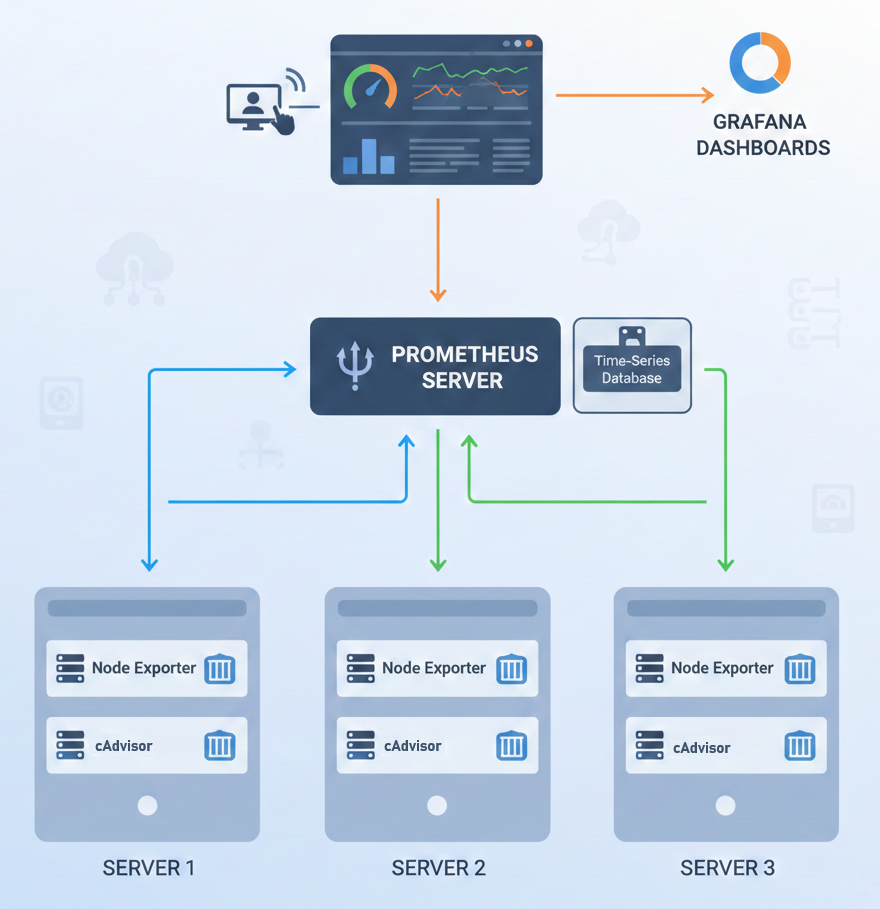

# Grafana_Prometheus_Monitoring
The following project is focused on a single server deployment. If more dockerized servers need to be monitored, go to the section **Multiple servers deployment**.

## Prerequisites
Prior to initialization, ensure that the required ports (9090, 3500, and 8088) are available and properly configured to allow incoming traffic for service accessibility.

## Project Structure
```
monitoring/
├── docker-compose.yml
└── prometheus.yml
```

## Deployment Steps

**Launch the stack:**

Open your terminal in the project folder and run:

`$ docker compose up -d`

**Access the services:**
- Prometheus: http://localhost:9090
- Grafana: http://localhost:3500 (User: admin / Pass: admin)
- cAdvisor: http://localhost:8088

**Configure Grafana:**
- Login to Grafana.
- Go to Connections > Data Sources.
- Click Add data source and select Prometheus.
- In the URL field, enter: http://prometheus:9090 (since they are in the same Docker network).
- Click Save & Test.

**Import Dashboards:** 
Go to Dashboards > New > Import and use these IDs:
- **1860**: To monitor the Server (Node Exporter).
- **14282**: To monitor Containers (cAdvisor).

**A quick tip:** If you don't see any data when trying to view cAdvisor metrics, make sure the container has sufficient permissions (that's why we add privileged: true in the compose file), as access to Docker stats is more restricted in some modern Linux distributions.

## Multiple servers deployment

**Multiple Servers Architecture**



**Deployment**

Clone the repository to the host machine. Adjust the `prometheus.yml` configuration to match your environment before running the deployment command: `$ docker compose up -d`. The `docker-compose.yml` file is pre-configured and should remain unchanged.

The following is an example:

```
global:
  scrape_interval: 15s

scrape_configs:
  - job_name: 'docker-servers'
    static_configs:
      - targets: 
          - 'IP_SERVER_1:9100' # Node Exporter
          - 'IP_SERVER_1:8080' # cAdvisor
          - 'IP_SERVER_2:9100'
          - 'IP_SERVER_2:8080'
          - 'IP_SERVER_3:9100'
          - 'IP_SERVER_3:8080'
```

**For the rest of servers:**

- Create the following docker-compose.yml file:
```
services:
  node-exporter:
    image: prom/node-exporter:latest
    container_name: node-exporter
    volumes:
      - /proc:/host/proc:ro
      - /sys:/host/sys:ro
      - /:/rootfs:ro
    command:
      - '--path.rootfs=/rootfs'
    ports:
      - 9100:9100

  cadvisor:
    image: gcr.io/cadvisor/cadvisor:latest
    container_name: cadvisor
    volumes:
      - /:/rootfs:ro
      - /var/run:/var/run:ro
      - /sys:/sys:ro
      - /var/lib/docker/:/var/lib/docker:ro
    ports:
      - 8080:8080
```
- Run the project: `$ docker compose up -d`